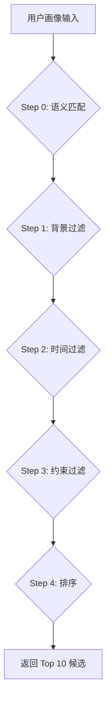

# 路径知识库 RAG 系统设计文档

> 版本：v1.2 (Final)  
> 更新日期：2025-12-31  
> 文档状态：✅ 已完成（可独立开发）

---

## 一、需求背景与目标

### 1.1 问题陈述

根据 PRD 文档的设计，本产品的核心功能之一是**基于用户画像推荐赚钱路径**。当前实现存在以下问题：

| 问题 | 现状 | 影响 |
|------|------|------|
| **AI 自由发挥** | 路径完全由 AI 模型生成 | 无法控制推荐内容的准确性和合规性 |
| **缺乏真实数据** | 收入预估纯属 AI "编造" | 用户信任度低，可能产生误导 |
| **无法迭代优化** | 没有结构化的路径数据 | 无法基于用户反馈持续优化 |

### 1.2 PRD 原始需求

PRD 文档中对知识库的要求（关键摘录）：

> **第 335 行**：从「路径知识库」中匹配适合的路径

> **第 891 行**：（AI路径规划师）必须基于「路径知识库」的内容

> **第 917 行**：在知识库中维护真实案例数据

### 1.3 目标

构建一个 **RAG (Retrieval-Augmented Generation)** 系统，实现：

1. **结构化存储**：建立路径知识库，存储经过验证的赚钱路径及其属性
2. **精准检索**：基于用户画像（背景、时间、约束）检索匹配的路径
3. **受控生成**：AI 只能从检索结果中选择和组合，不能自行编造
4. **真实案例**：每条路径附带真实案例数据，增强说服力

### 1.4 系统架构图

```
┌─────────────────────────────────────────────────────────────────┐
│                          用户输入                                │
│  • 收入目标：50万/年                                             │
│  • 背景：技术/开发                                               │
│  • 时间：10-20h/周                                               │
│  • 约束：不愿露脸                                                │
└──────────────────────────┬──────────────────────────────────────┘
                           │
                           ▼
┌──────────────────────────────────────────────────────────────────┐
│                    Step 1: 检索 (Retrieval)                       │
│  ┌────────────────────────────────────────────────────────────┐  │
│  │  SELECT * FROM path_templates                               │  │
│  │  WHERE '技术/开发' = ANY(suitable_backgrounds)              │  │
│  │    AND min_weekly_hours <= 15                               │  │
│  │    AND requires_show_face = false                           │  │
│  │    AND is_active = true                                     │  │
│  │  ORDER BY income_max DESC                                   │  │
│  │  LIMIT 10                                                   │  │
│  └────────────────────────────────────────────────────────────┘  │
│                           │                                      │
│                           ▼                                      │
│  候选路径（10条）：                                               │
│  • 微型 SaaS（10-100万）                                         │
│  • 技术外包（20-60万）                                            │
│  • 付费专栏（5-30万）                                             │
│  • ...                                                          │
└──────────────────────────┬──────────────────────────────────────┘
                           │
                           ▼
┌──────────────────────────────────────────────────────────────────┐
│                 Step 2: 生成 (Generation)                         │
│  ┌────────────────────────────────────────────────────────────┐  │
│  │  System Prompt:                                             │  │
│  │  你是副业规划师。                                            │  │
│  │  用户目标：50万/年                                           │  │
│  │  候选路径池：[上述10条路径的详细信息]                         │  │
│  │                                                             │  │
│  │  任务：从候选池中选择3条最合适的路径组合，                     │  │
│  │  确保总收入覆盖目标。你不能推荐候选池之外的路径。             │  │
│  └────────────────────────────────────────────────────────────┘  │
│                           │                                      │
│                           ▼                                      │
│  AI 输出（3条）：                                                 │
│  1. 微型 SaaS（推荐理由：...）                                    │
│  2. 技术外包（推荐理由：...）                                     │
│  3. 付费专栏（推荐理由：...）                                     │
└──────────────────────────────────────────────────────────────────┘
```

---

## 二、知识库数据结构设计

> 本节定义 `path_templates` 表的完整 Schema。

### 2.1 表结构

```sql
CREATE TABLE path_templates (
  -- 主键
  id UUID PRIMARY KEY DEFAULT gen_random_uuid(),
  
  -- 基本信息
  name TEXT NOT NULL,                         -- 路径名称（如"开发微型SaaS"）
  category TEXT NOT NULL,                     -- 类型（见下方枚举）
  description TEXT NOT NULL,                  -- 1-2句话描述
  
  -- 收入预估
  income_min INTEGER NOT NULL,                -- 最低年收入（万元）
  income_max INTEGER NOT NULL,                -- 最高年收入（万元）
  ramp_up_months INTEGER DEFAULT 6,           -- 爬坡期（月）
  
  -- 适用条件
  suitable_backgrounds TEXT[] NOT NULL,       -- 适合的职业背景（数组）
  min_weekly_hours INTEGER DEFAULT 10,        -- 最低每周投入时间
  
  -- 约束标记（true = 该路径需要此条件）
  requires_show_face BOOLEAN DEFAULT false,   -- 需要露脸
  requires_social BOOLEAN DEFAULT false,      -- 需要频繁社交
  requires_upfront_cost BOOLEAN DEFAULT false,-- 需要前期投入资金
  long_term_no_income BOOLEAN DEFAULT false,  -- 可能长期无收入
  
  -- 真实案例（JSONB 数组）
  real_cases JSONB DEFAULT '[]',
  
  -- 辅助信息
  keywords TEXT[],                            -- 关键词（用于语义匹配）
  tips TEXT,                                  -- 给用户的建议/提示
  risks TEXT,                                 -- 风险提示
  
  -- 元数据
  sort_order INTEGER DEFAULT 0,               -- 排序权重
  is_active BOOLEAN DEFAULT true,             -- 是否启用
  created_at TIMESTAMPTZ DEFAULT now(),
  updated_at TIMESTAMPTZ DEFAULT now()
);
```

### 2.2 字段枚举定义

#### category（路径类型）

| 值 | 中文 | 示例 |
|----|------|------|
| `product` | 产品 | SaaS、Chrome插件、付费模板 |
| `content` | 内容 | 博客、视频、专栏、课程 |
| `service` | 服务 | 外包、咨询、代运营 |
| `ecommerce` | 电商 | 跨境电商、数字产品 |
| `investment` | 投资 | 股票、基金、房产 |
| `offline` | 线下 | 工作室、培训、摆摊 |

#### suitable_backgrounds（适用背景）

必须是以下值的子集（与 PRD P3 保持一致）：

```typescript
type Background = 
  | '技术/开发'
  | '设计'
  | '运营/营销'
  | '内容创作'
  | '销售'
  | '传统行业'
  | '其他';
```

#### real_cases（真实案例结构）

```typescript
interface RealCase {
  name: string;           // 案例名称（匿名化，如"某独立开发者"）
  income: string;         // 收入描述（如"年入50万"）
  timeline: string;       // 时间线（如"启动6个月后盈利"）
  source?: string;        // 来源（可选，如"V2EX分享"）
  quote?: string;         // 原话引用（可选）
}
```

### 2.3 索引设计

```sql
-- 按类型筛选
CREATE INDEX idx_path_templates_category ON path_templates(category);

-- 按激活状态筛选
CREATE INDEX idx_path_templates_active ON path_templates(is_active) WHERE is_active = true;

-- 按收入上限排序（推荐时优先高收入）
CREATE INDEX idx_path_templates_income ON path_templates(income_max DESC);

-- GIN 索引支持数组查询
CREATE INDEX idx_path_templates_backgrounds ON path_templates USING GIN(suitable_backgrounds);
CREATE INDEX idx_path_templates_keywords ON path_templates USING GIN(keywords);
```

---

## 三、知识库内容需求（核心章节）

> 本节定义知识库应包含的内容、数量、颗粒度和真实性要求。

### 3.0 知识库规划总览

#### 3.0.1 为什么 20 条不够？

根据 PRD 分析，系统需要覆盖：
- **7 种用户背景**：技术/开发、设计、运营/营销、内容创作、销售、传统行业、其他
- **6 种路径类型**：产品、内容、服务、电商、投资、线下
- **4 种约束条件**：露脸、社交、投钱、长期无收入

如果只有 20 条路径，会出现：
- 某些背景（如销售、传统行业）几乎没有匹配路径
- 约束严格的用户（如不露脸 + 不社交 + 不投钱）可能匹配不到任何路径
- 推荐结果重复、单调

#### 3.0.2 数量规划：至少 50 条

| 目标 | 数量要求 | 原因 |
|------|----------|------|
| **每个背景至少 5 条可选** | 7 × 5 = 35 条 | 确保每种背景用户都有选择 |
| **每个类别至少 5 条** | 6 × 5 = 30 条 | 确保类别多样性 |
| **约束覆盖** | 需要路径覆盖所有约束组合 | 避免死胡同 |
| **推荐储备** | 检索 Top 10 选 3，需要足够候选 | 避免重复 |

**结论：初期目标 50 条，长期目标 100+ 条**

#### 3.0.3 颗粒度定义

每条路径必须包含以下字段的**完整内容**：

| 字段 | 颗粒度要求 | 示例 |
|------|-----------|------|
| `name` | 简短明确，5-15 字 | "开发微型 SaaS" |
| `description` | 1-2 句话说明是什么、怎么赚钱 | "开发解决特定小众需求的 SaaS 工具，通过订阅制收费" |
| `income_min/max` | 基于真实数据的范围（万/年） | 10-100 |
| `ramp_up_months` | 预计多久见到第一笔收入 | 6-12 |
| `suitable_backgrounds` | 明确列出适合的背景 | ["技术/开发"] |
| `min_weekly_hours` | 最低时间投入要求 | 20 |
| `requires_*` | 明确标记约束条件 | requires_show_face: false |
| `keywords` | 3-8 个关键词，用于语义匹配 | ["SaaS", "订阅", "独立开发", "被动收入"] |
| `tips` | 给用户的 1-2 句建议 | "建议从自己熟悉的领域入手" |
| `risks` | 风险提示 | "可能 6-12 个月无收入" |
| `real_cases` | **至少 1 个真实案例** | 见下文 |

#### 3.0.4 真实性政策（Authenticity Policy）

> [!IMPORTANT]
> 这是知识库质量的核心。

| 字段 | 真实性要求 | 来源要求 |
|------|-----------|----------|
| `income_min/max` | **必须真实** | 基于至少 2 个独立来源（社区分享、行业报告） |
| `ramp_up_months` | **必须真实** | 基于真实案例的时间线 |
| `real_cases` | **必须真实，可匿名** | 来源于公开的社区分享、访谈、收入报告 |
| `description` | 可以 AI 辅助润色 | 但核心内容必须准确 |
| `tips/risks` | 可以 AI 辅助生成 | 但不能编造风险 |

**案例真实性标准**：
```
✅ 可接受：
- "某独立开发者，MRR $3000+，8 个月盈利"（匿名但有具体数据）
- "V2EX 用户分享，年入 30 万"（有来源平台）

❌ 不可接受：
- "预计年入 50 万"（没有案例支撑）
- "轻松月入过万"（夸大宣传）
```

#### 3.0.5 覆盖度检查矩阵

为确保每种用户组合都能匹配到路径，需要检查以下矩阵：

| 背景 \ 约束 | 无约束 | 不露脸 | 不社交 | 不投钱 | 不等待 | 全约束 |
|------------|--------|--------|--------|--------|--------|--------|
| 技术/开发 | ✅ | ✅ | ✅ | ✅ | ✅ | ? |
| 设计 | ✅ | ✅ | ✅ | ✅ | ✅ | ? |
| 运营/营销 | ? | ? | ? | ✅ | ✅ | ? |
| 内容创作 | ✅ | ✅ | ✅ | ✅ | ✅ | ? |
| 销售 | ? | ? | ? | ✅ | ✅ | ? |
| 传统行业 | ? | ? | ? | ? | ✅ | ? |
| 其他 | ✅ | ✅ | ? | ✅ | ✅ | ? |

**标记说明**：
- ✅ = 有至少 3 条可选路径
- ? = 需要补充

---

### 3.1 数据来源

种子数据应基于以下可靠来源：

| 来源 | 类型 | 可信度 |
|------|------|--------|
| V2EX 分享帖 | 社区经验 | 中 |
| 即刻/少数派 | 社区经验 | 中 |
| 公开收入报告 | 官方数据 | 高 |
| 独立开发者公开访谈 | 一手信息 | 高 |
| 行业报告 | 统计数据 | 高（用于范围验证） |

### 3.2 数据质量要求

每条路径必须满足：

1. **收入范围真实**：基于至少 2 个独立来源验证
2. **案例可追溯**：至少包含 1 个真实案例（可匿名）
3. **约束准确**：明确标记是否需要露脸/社交/投入等
4. **覆盖度均衡**：每个 category 至少 3 条路径

### 3.3 完整路径清单（50条）

> [!NOTE]
> 以下 50 条路径覆盖 7 种背景 × 6 种类别，确保每种用户都能匹配到至少 5 条路径。

#### 3.3.1 产品类（product）- 10 条

| # | name | income_min | income_max | suitable_backgrounds | min_hours | 约束 |
|---|------|------------|------------|---------------------|-----------|------|
| 1 | 开发微型 SaaS | 10 | 100 | 技术/开发 | 20 | 无收入 |
| 2 | Chrome/浏览器插件 | 5 | 50 | 技术/开发 | 10 | - |
| 3 | 付费模板（Notion/Figma） | 2 | 20 | 设计, 技术/开发 | 10 | - |
| 4 | 开源项目+赞助 | 1 | 30 | 技术/开发 | 15 | 无收入 |
| 5 | 微信小程序/独立 App | 10 | 80 | 技术/开发 | 25 | - |
| 6 | WordPress 主题/插件 | 5 | 40 | 技术/开发 | 15 | - |
| 7 | Canva 模板销售 | 2 | 15 | 设计 | 10 | - |
| 8 | PPT/简历模板 | 1 | 10 | 设计, 运营/营销 | 5 | - |
| 9 | 表格/自动化工具 | 3 | 25 | 技术/开发, 运营/营销 | 10 | - |
| 10 | 行业垂直工具 | 10 | 60 | 技术/开发, 传统行业 | 20 | - |

#### 3.3.2 内容类（content）- 12 条

| # | name | income_min | income_max | suitable_backgrounds | min_hours | 约束 |
|---|------|------------|------------|---------------------|-----------|------|
| 11 | 技术博客/SEO 流量站 | 2 | 30 | 技术/开发, 内容创作 | 10 | - |
| 12 | YouTube/B站技术频道 | 5 | 100 | 技术/开发, 内容创作 | 15 | 露脸 |
| 13 | 付费专栏（掘金/知乎） | 3 | 20 | 技术/开发, 内容创作 | 10 | - |
| 14 | 在线课程（网易云课堂等） | 5 | 50 | 技术/开发, 设计 | 20 | - |
| 15 | 知识星球/会员社群 | 5 | 50 | 全部 | 10 | 社交 |
| 16 | 小红书/抖音图文号 | 3 | 40 | 运营/营销, 内容创作 | 15 | - |
| 17 | 播客节目 | 2 | 20 | 内容创作, 全部 | 10 | - |
| 18 | 电子书/自出版 | 2 | 30 | 内容创作, 全部 | 15 | 无收入 |
| 19 | Newsletter 付费订阅 | 3 | 25 | 内容创作, 运营/营销 | 10 | - |
| 20 | 短视频/Vlog（不露脸） | 2 | 30 | 内容创作, 设计 | 15 | - |
| 21 | 设计素材分享账号 | 2 | 15 | 设计 | 10 | - |
| 22 | 行业分析报告 | 5 | 40 | 运营/营销, 销售, 传统行业 | 15 | - |

#### 3.3.3 服务类（service）- 12 条

| # | name | income_min | income_max | suitable_backgrounds | min_hours | 约束 |
|---|------|------------|------------|---------------------|-----------|------|
| 23 | 技术外包/接私活 | 20 | 80 | 技术/开发 | 20 | - |
| 24 | 设计外包 | 15 | 50 | 设计 | 15 | - |
| 25 | 咨询顾问 | 10 | 100 | 全部 | 10 | 社交 |
| 26 | 代运营（公众号/小红书） | 10 | 40 | 运营/营销, 内容创作 | 20 | - |
| 27 | SEO/SEM 服务 | 10 | 50 | 运营/营销, 技术/开发 | 15 | - |
| 28 | 企业培训讲师 | 15 | 80 | 全部 | 10 | 露脸, 社交 |
| 29 | 职业规划/简历优化 | 5 | 30 | 运营/营销, 销售 | 10 | 社交 |
| 30 | 翻译/本地化服务 | 5 | 30 | 内容创作, 其他 | 15 | - |
| 31 | 写作/文案服务 | 5 | 25 | 内容创作, 运营/营销 | 10 | - |
| 32 | 数据分析服务 | 10 | 50 | 技术/开发, 运营/营销 | 15 | - |
| 33 | 财务/税务咨询 | 10 | 60 | 传统行业, 其他 | 10 | 社交 |
| 34 | 法律咨询（持证） | 15 | 80 | 传统行业, 其他 | 10 | 社交 |

#### 3.3.4 电商类（ecommerce）- 8 条

| # | name | income_min | income_max | suitable_backgrounds | min_hours | 约束 |
|---|------|------------|------------|---------------------|-----------|------|
| 35 | 跨境电商（亚马逊/Shopify） | 10 | 100 | 销售, 运营/营销 | 30 | 投钱 |
| 36 | 数字产品销售（Gumroad） | 2 | 30 | 技术/开发, 设计 | 10 | - |
| 37 | 闲鱼/转转倒卖 | 2 | 15 | 销售, 全部 | 10 | - |
| 38 | 淘宝/拼多多店铺 | 5 | 50 | 销售, 运营/营销 | 25 | 投钱 |
| 39 | 社群团购 | 5 | 30 | 销售, 运营/营销, 传统行业 | 15 | 社交 |
| 40 | 虚拟产品代理 | 3 | 20 | 销售, 运营/营销 | 10 | - |
| 41 | 联盟营销/Affiliate | 2 | 30 | 运营/营销, 内容创作 | 10 | - |
| 42 | 定制产品（手工/个性化） | 5 | 30 | 设计, 传统行业 | 20 | - |

#### 3.3.5 投资类（investment）- 4 条

| # | name | income_min | income_max | suitable_backgrounds | min_hours | 约束 |
|---|------|------------|------------|---------------------|-----------|------|
| 43 | 量化交易/自动化投资 | 5 | 100 | 技术/开发 | 10 | 投钱, 无收入 |
| 44 | 房产出租 | 5 | 30 | 全部 | 5 | 投钱 |
| 45 | 指数基金定投 | 2 | 20 | 全部 | 2 | 投钱, 无收入 |
| 46 | 私域流量变现 | 5 | 50 | 运营/营销, 销售 | 15 | 社交 |

#### 3.3.6 线下类（offline）- 4 条

| # | name | income_min | income_max | suitable_backgrounds | min_hours | 约束 |
|---|------|------------|------------|---------------------|-----------|------|
| 47 | 技术培训/工作坊 | 10 | 50 | 技术/开发 | 15 | 露脸, 社交 |
| 48 | 自由职业者合伙人 | 20 | 80 | 全部 | 25 | 社交 |
| 49 | 本地服务（摄影/剪辑） | 10 | 40 | 设计, 内容创作 | 20 | - |
| 50 | 兼职讲师/家教 | 5 | 25 | 全部 | 10 | 露脸, 社交 |

### 3.4 完整数据示例（JSON）

以下是一条完整的种子数据示例：

```json
{
  "id": "550e8400-e29b-41d4-a716-446655440001",
  "name": "开发微型 SaaS",
  "category": "product",
  "description": "开发一个解决特定小众需求的 SaaS 工具，通过订阅制收费",
  "income_min": 10,
  "income_max": 100,
  "ramp_up_months": 12,
  "suitable_backgrounds": ["技术/开发"],
  "min_weekly_hours": 20,
  "requires_show_face": false,
  "requires_social": false,
  "requires_upfront_cost": false,
  "long_term_no_income": true,
  "real_cases": [
    {
      "name": "某独立开发者",
      "income": "MRR $3000+",
      "timeline": "全职投入 8 个月后盈利",
      "source": "IndieHackers 访谈",
      "quote": "找到一个你自己会用的痛点，比研究市场更重要"
    },
    {
      "name": "国内开发者 A",
      "income": "年收入约 30 万",
      "timeline": "业余开发 1 年，辞职后半年做到盈亏平衡",
      "source": "V2EX 分享"
    }
  ],
  "keywords": ["SaaS", "订阅", "独立开发", "被动收入"],
  "tips": "建议从自己熟悉的领域入手，先做 MVP 验证",
  "risks": "可能 6-12 个月无收入，需要有一定储蓄",
  "sort_order": 1,
  "is_active": true
}
```

---

## 四、RAG 检索算法设计

> 本节定义从知识库检索匹配路径的算法逻辑。

### 4.1 检索流程



### 4.2 过滤规则

#### Step 0: 语义匹配 (Semantic Matching) - 精准分析核心

用户在 P4 提交的 `openQuestion`（如"我想做一个开发者工具"）需要与路径的 `keywords` 进行语义匹配。

**匹配逻辑**：

```typescript
// 将用户输入分词并匹配关键词
function semanticBoost(paths: PathTemplate[], openQuestion: string): PathTemplate[] {
  const userKeywords = extractKeywords(openQuestion);
  
  return paths.map(path => {
    const matchScore = path.keywords?.filter(k => 
      userKeywords.some(uk => uk.includes(k) || k.includes(uk))
    ).length || 0;
    
    return { ...path, _semanticScore: matchScore };
  }).sort((a, b) => b._semanticScore - a._semanticScore);
}

// 简单分词函数（可替换为 jieba 等更专业的分词库）
function extractKeywords(text: string): string[] {
  const stopWords = ['我', '想', '做', '一个', '的', '是', '有', '能', '可以'];
  return text.split(/[\s,。、]+/).filter(w => w.length > 1 && !stopWords.includes(w));
}
```

**示例**：
- 用户输入："我想做自媒体博客"
- 提取关键词：`['自媒体', '博客']`
- 匹配结果："技术博客/SEO 流量站" (keywords: ['博客', 'SEO']) 得分 +1

**在检索中的应用**：

```typescript
async function retrieveMatchingPaths(params: RetrieveParams) {
  // ... 基础过滤 (Step 1-3) ...
  let results = await query.limit(20); // 先取更多
  
  // Step 0: 语义匹配提升排序
  if (params.openQuestion) {
    results = semanticBoost(results, params.openQuestion);
  }
  
  return results.slice(0, 10); // 返回 Top 10
}
```

#### Step 1: 背景匹配

```sql
WHERE user_background = ANY(suitable_backgrounds)
   OR 'other' = ANY(suitable_backgrounds)
   OR '全部' = ANY(suitable_backgrounds)
```

- 用户背景必须在路径的 `suitable_backgrounds` 数组中
- 特殊值 `'其他'` 和 `'全部'` 匹配所有背景

#### Step 2: 时间匹配

用户时间投入转换为小时数：

| 用户选择 | 转换值 |
|----------|--------|
| `<10h` | 8 |
| `10-20h` | 15 |
| `20-40h` | 30 |
| `40h+` | 45 |

```sql
WHERE min_weekly_hours <= :user_hours
```

#### Step 3: 约束过滤

用户选择的"不愿意做"项，对应路径的 `requires_*` 字段：

| 用户约束 | 排除条件 |
|----------|----------|
| 露脸 | `requires_show_face = true` |
| 频繁社交 | `requires_social = true` |
| 前期投钱 | `requires_upfront_cost = true` |
| 长期无收入 | `long_term_no_income = true` |

```sql
WHERE (NOT requires_show_face OR '露脸' NOT IN :constraints)
  AND (NOT requires_social OR '频繁社交' NOT IN :constraints)
  AND (NOT requires_upfront_cost OR '前期投钱' NOT IN :constraints)
  AND (NOT long_term_no_income OR '长期无收入' NOT IN :constraints)
```

#### Step 4: 排序

按以下优先级排序：

1. **收入上限 (income_max)**：降序，优先推荐高收入路径
2. **排序权重 (sort_order)**：升序，权重小的优先
3. **爬坡期 (ramp_up_months)**：升序，快速变现优先

```sql
ORDER BY income_max DESC, sort_order ASC, ramp_up_months ASC
LIMIT 10
```

### 4.3 完整查询伪代码

```typescript
interface UserProfile {
  background: string;      // '技术/开发'
  weeklyHours: string;     // '10-20h'
  constraints: string[];   // ['露脸']
}

interface RetrieveParams {
  profile: UserProfile;
  incomeGoal: number;
}

async function retrieveMatchingPaths(params: RetrieveParams) {
  const { profile, incomeGoal } = params;
  
  // 转换时间
  const hoursMap = { '<10h': 8, '10-20h': 15, '20-40h': 30, '40h+': 45 };
  const userHours = hoursMap[profile.weeklyHours] || 15;
  
  // 构建查询
  let query = supabase
    .from('path_templates')
    .select('*')
    .eq('is_active', true)
    .or(`suitable_backgrounds.cs.{${profile.background}},suitable_backgrounds.cs.{全部}`)
    .lte('min_weekly_hours', userHours);
  
  // 约束过滤
  if (profile.constraints.includes('露脸')) {
    query = query.eq('requires_show_face', false);
  }
  if (profile.constraints.includes('频繁社交')) {
    query = query.eq('requires_social', false);
  }
  if (profile.constraints.includes('前期投钱')) {
    query = query.eq('requires_upfront_cost', false);
  }
  if (profile.constraints.includes('长期无收入')) {
    query = query.eq('long_term_no_income', false);
  }
  
  // 排序并限制数量
  const { data, error } = await query
    .order('income_max', { ascending: false })
    .order('sort_order', { ascending: true })
    .limit(10);
  
  return data || [];
}
```

### 4.4 边界情况处理

| 情况 | 处理方式 |
|------|----------|
| 匹配结果 < 3 条 | 放宽约束条件（移除部分 constraints），重新检索 |
| 候选路径总收入 < 用户目标 | 在 AI Prompt 中提示"可能需要投入更多时间" |
| 用户选择"其他"背景 | 匹配所有标记为"全部"的路径 |
| AI 返回解析失败 | 使用 fallback 逻辑，直接返回检索结果前 3 条 |

#### 结果不足时的降级逻辑

```typescript
async function retrieveWithFallback(params: RetrieveParams): Promise<PathTemplate[]> {
  let results = await retrieveMatchingPaths(params);
  
  // 如果结果不足 3 条，逐步放宽约束
  if (results.length < 3 && params.profile.constraints.length > 0) {
    const relaxedParams = {
      ...params,
      profile: {
        ...params.profile,
        constraints: params.profile.constraints.slice(0, -1)
      }
    };
    results = await retrieveMatchingPaths(relaxedParams);
  }
  
  // 如果仍然不足，移除背景限制
  if (results.length < 3) {
    const { data } = await supabase
      .from('path_templates')
      .select('*')
      .eq('is_active', true)
      .order('income_max', { ascending: false })
      .limit(10);
    results = data || [];
  }
  
  return results;
}
```

#### AI 解析失败的 Fallback

```typescript
try {
  const aiOutput = JSON.parse(result.choices[0].message.content);
  // ... 正常流程
} catch (parseError) {
  console.error('[AI Parse Error]', parseError);
  // Fallback: 直接返回检索结果前 3 条
  return {
    success: true,
    data: {
      paths: candidates.slice(0, 3).map(p => ({
        name: p.name,
        category: p.category,
        incomeMin: p.income_min,
        incomeMax: p.income_max,
        reason: p.description,
        realCases: p.real_cases,
        risks: p.risks
      })),
      totalIncomeMin: candidates.slice(0, 3).reduce((s, p) => s + p.income_min, 0),
      totalIncomeMax: candidates.slice(0, 3).reduce((s, p) => s + p.income_max, 0),
      _fallback: true
    }
  };
}
```

---

## 五、API 接口改造方案

> 本节定义需要修改的 API 接口及新增接口。

### 5.1 现有接口改造

#### 5.1.1 `POST /api/wizard/ai/recommend`

**改造前**：
```typescript
// 直接调用 AI 生成路径（无知识库）
const result = await zhipuClient.chat([
  { role: 'system', content: '你是副业规划师...' },
  { role: 'user', content: '请开始推荐' }
]);
```

**改造后**：
```typescript
// Step 1: 从知识库检索候选路径
const candidates = await retrieveMatchingPaths({ profile, incomeGoal });

// Step 2: 构建带有候选池的 Prompt
const systemPrompt = `
你是一个专业的副业规划师。

用户画像：
- 目标收入：${incomeGoal}万/年
- 背景：${profile.background}
- 时间：${profile.weeklyHours}
- 约束：${profile.constraints.join(', ')}

候选路径池（你只能从以下路径中选择）：
${candidates.map((p, i) => `
${i + 1}. ${p.name}
   - 类型：${p.category}
   - 收入：${p.income_min}-${p.income_max}万/年
   - 爬坡期：${p.ramp_up_months}个月
   - 描述：${p.description}
`).join('')}

任务：
1. 从候选池中选择 3 条最适合用户的路径
2. 计算总收入范围，确保覆盖用户目标
3. 为每条路径撰写个性化推荐理由（20字内）
4. 返回严格的 JSON 格式

⚠️ 重要：你不能推荐候选池之外的任何路径。
`;

// Step 3: 调用 AI 进行选择和润色
const result = await zhipuClient.chat([
  { role: 'system', content: systemPrompt },
  { role: 'user', content: '请开始推荐' }
]);

// Step 4: 解析结果并附加真实案例
const aiOutput = JSON.parse(result.choices[0].message.content);
const enrichedPaths = aiOutput.paths.map(path => {
  const template = candidates.find(c => c.name === path.name);
  return {
    ...path,
    id: template?.id,
    real_cases: template?.real_cases || [],
    tips: template?.tips,
    risks: template?.risks
  };
});

return { success: true, data: { paths: enrichedPaths, ... } };
```

### 5.2 新增接口

#### 5.2.1 `GET /api/admin/path-templates`

获取所有路径模板（管理用）

**响应**：
```json
{
  "success": true,
  "data": {
    "templates": [
      {
        "id": "uuid",
        "name": "开发微型 SaaS",
        "category": "product",
        "income_min": 10,
        "income_max": 100,
        "is_active": true,
        ...
      }
    ],
    "total": 20
  }
}
```

#### 5.2.2 `POST /api/admin/path-templates`

新增路径模板

**请求**：
```json
{
  "name": "新路径名称",
  "category": "product",
  "description": "...",
  "income_min": 10,
  "income_max": 50,
  "suitable_backgrounds": ["技术/开发"],
  "min_weekly_hours": 15,
  "requires_show_face": false,
  ...
}
```

#### 5.2.3 `PUT /api/admin/path-templates/:id`

更新路径模板

#### 5.2.4 `DELETE /api/admin/path-templates/:id`

删除路径模板（软删除，设置 `is_active = false`）

### 5.3 新增工具函数

#### `server/utils/path-retrieval.ts`

```typescript
// 检索匹配路径的核心函数
export async function retrieveMatchingPaths(params: RetrieveParams) {
  // 实现见 4.3 节伪代码
}

// 时间字符串转小时数
export function weeklyHoursToNumber(hours: string): number {
  const map = { '<10h': 8, '10-20h': 15, '20-40h': 30, '40h+': 45 };
  return map[hours] || 15;
}
```

---

## 六、前端展示改动

> 本节定义前端页面需要配合的改动。

### 6.1 路径推荐卡片改造

#### 现有设计

```
┌─────────────────────────────────────────────────────┐
│ ☑ 路径1：做项目管理SaaS工具               10-50万/年 │
│   符合你的想法，技术匹配                              │
└─────────────────────────────────────────────────────┘
```

#### 改造后设计

```
┌─────────────────────────────────────────────────────┐
│ ☑ 路径1：做项目管理SaaS工具               10-50万/年 │
│   符合你的想法，技术匹配                              │
│                                                      │
│   💡 真实案例：某独立开发者 8 个月做到 MRR $3000      │
│   ⚠️ 风险提示：可能 6-12 个月无收入                  │
└─────────────────────────────────────────────────────┘
```

### 6.2 新增字段展示

| 字段 | 展示位置 | 样式 |
|------|----------|------|
| `real_cases` | 卡片底部 | 💡 图标 + 灰色小字 |
| `risks` | 卡片底部 | ⚠️ 图标 + 橙色小字 |
| `tips` | 详情页/Tooltip | Tooltip 或展开详情 |
| `ramp_up_months` | 收入范围旁边 | 如 "约6月见收入" |

### 6.3 涉及文件

| 文件 | 改动说明 |
|------|----------|
| `pages/wizard/paths.vue` | 路径推荐页面，展示真实案例和风险 |
| `components/wizard/PathCard.vue` | 路径卡片组件（可能新增） |

### 6.4 数据结构变更

#### 前端接收的路径数据结构

```typescript
interface RecommendedPath {
  id: string;
  name: string;
  category: string;
  incomeMin: number;
  incomeMax: number;
  reason: string;        // AI 生成的推荐理由
  rampUpMonths: number;  // 新增：爬坡期
  realCases: Array<{     // 新增：真实案例
    name: string;
    income: string;
    timeline: string;
    quote?: string;
  }>;
  tips?: string;         // 新增：建议
  risks?: string;        // 新增：风险提示
}
```

---

## 七、验证与测试方案

> 本节定义如何验证 RAG 系统的正确性。

### 7.1 数据库验证

#### 检查表创建

```sql
-- 确认表存在
SELECT table_name FROM information_schema.tables 
WHERE table_name = 'path_templates';

-- 确认数据条数
SELECT COUNT(*) FROM path_templates WHERE is_active = true;
-- 期望结果：>= 20
```

#### 检查索引

```sql
SELECT indexname FROM pg_indexes WHERE tablename = 'path_templates';
-- 期望结果：包含 idx_path_templates_category, idx_path_templates_backgrounds 等
```

### 7.2 检索逻辑验证

#### 测试用例 1：技术背景 + 不露脸

**输入**：
```json
{
  "background": "技术/开发",
  "weeklyHours": "10-20h",
  "constraints": ["露脸"]
}
```

**期望**：
- 返回结果中**不包含** `requires_show_face = true` 的路径
- 返回结果中**只包含** `suitable_backgrounds` 包含 `技术/开发` 或 `全部` 的路径

#### 测试用例 2：设计背景 + 不投钱

**输入**：
```json
{
  "background": "设计",
  "weeklyHours": "20-40h",
  "constraints": ["前期投钱"]
}
```

**期望**：
- 返回结果中**不包含** `requires_upfront_cost = true` 的路径
- 返回结果中**包含**：设计外包、付费模板等

#### 测试用例 3：边界情况 - 严格约束导致结果过少

**输入**：
```json
{
  "background": "传统行业",
  "weeklyHours": "<10h",
  "constraints": ["露脸", "频繁社交", "前期投钱", "长期无收入"]
}
```

**期望**：
- 若结果 < 3 条，系统应自动放宽约束重新检索
- 最终返回至少 3 条路径

### 7.3 API 集成测试

```bash
# 测试推荐接口
curl -X POST http://localhost:3000/api/wizard/ai/recommend \
  -H "Content-Type: application/json" \
  -d '{
    "context": {
      "incomeGoal": 50,
      "profile": {
        "background": "技术/开发",
        "weeklyHours": "10-20h",
        "constraints": ["露脸"]
      },
      "openQuestion": "想做技术相关的副业"
    }
  }'
```

**验证点**：
1. 返回 `success: true`
2. `paths` 数组长度 = 3
3. 每条路径包含 `real_cases` 字段
4. 没有路径的 `requires_show_face = true`

### 7.4 UI 回归测试

| 测试场景 | 验证点 |
|----------|--------|
| 完成 P3 快速画像 | 页面正常跳转，无报错 |
| P7 路径推荐展示 | 卡片正确显示路径名称、收入范围、推荐理由 |
| 点击展开真实案例 | 案例内容正确渲染 |
| 选择路径后进入 P8 | 数据正确传递 |

---

## 八、附录

### 8.1 文档修订历史

| 版本 | 日期 | 修订内容 |
|------|------|----------|
| v1.0 | 2025-12-31 | 初稿完成 |

### 8.2 相关文档

- [PRD.md](file:///Users/pyxm1618/Downloads/大排期/docs/PRD.md)
- [technical-design.md](file:///Users/pyxm1618/Downloads/大排期/docs/technical-design.md)

---

**文档状态**：✅ 已完成
