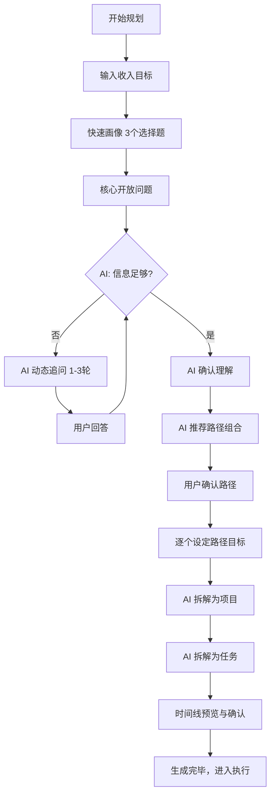

# 产品需求文档（PRD）

> 产品名称：钱途（暂定）  
> 版本：v1.0  
> 更新日期：2025-12-30  
> 文档状态：需求确认中

---

## 一、产品概述

### 1.1 产品定位

**一句话描述**：
> "输入你想赚的钱，AI 帮你画一张路线图，拆解成每天该做的事"

**核心价值**：
- 帮助想赚钱的人将「目标」转化为「可执行的计划」
- 通过 AI 将年度收入目标拆解为多条路径 → 具体项目 → 每日任务
- 提供监督机制，增强执行力和传播性

---

### 1.2 目标用户

**核心用户群**：
- 副业赚钱的职场人
- 准备裸辞创业的人
- 自由职业者/独立开发者
- 失业/待业中想规划收入的人

**排除用户**：
- 学生
- 已退休人员

**用户特征**：
- 有明确的收入目标（10-100万/年为主）
- 有一定专业技能或资源
- 需要更清晰的行动路径
- 缺乏监督和执行动力

---

### 1.3 核心问题

| 用户痛点 | 现状 | 本产品解决方案 |
|---------|------|---------------|
| **决策瘫痪** | 有目标但不知道怎么做 | AI 推荐路径组合 |
| **计划空洞** | 制定了计划但不落地 | 拆解到每日任务 |
| **缺乏监督** | 一个人很难坚持 | 好友监督机制 |
| **信息过载** | 知道太多路径反而选不出来 | AI 基于用户画像匹配最合适的 |

---

### 1.4 竞品对比

| 竞品 | 优势 | 劣势 | 我们的差异化 |
|------|------|------|-------------|
| **滴答清单** | 任务管理成熟 | 纯工具，无规划引导 | AI 拆解 + 赚钱导向 |
| **飞书 OKR** | OKR 方法论 | 企业场景，不适合个人 | 个人副业/创业场景 |
| **Notion** | 灵活 | 需要自己折腾模板 | 开箱即用，AI 辅助 |
| **Goblin Tools** | AI 拆解任务 | 只拆任务，无时间线、无追踪 | 全流程覆盖（目标→任务→执行→追踪） |

---

### 1.5 产品边界

**包含**：
- 所有行业背景的用户（只要有赚钱目标）
- 所有路径类型（产品、内容、服务、电商、投资、线下）
- 收入目标无上下限

**不包含（MVP阶段）**：
- 学生、退休人员
- 团队协作功能
- 移动端（先做 Web）
- 提醒通知（二期）
- 周报复盘（二期）

---

### 1.6 商业模式

**付费模式**：订阅制

**功能分级**（待定）：
- 免费版：只能创建 1 条路径
- 付费版：无限路径 + 监督功能 + 更多 AI 调用次数

---

## 二、核心功能模块

产品分为 4 个核心模块：

1. **目标设定与 AI 拆解**（首次使用）
2. **日常执行**（Dashboard + 任务列表）
3. **进度追踪**（统计 + 调整）
4. **病毒传播**（监督功能 + 分享）

---

## 三、核心流程：目标设定与 AI 拆解

### 3.1 流程图 Overview



---

### 3.2 详细页面设计

#### P1: 开始页
- **文案**："2025年想赚多少钱？一张图看清你的赚钱路线"
- **展示**：一个高诱惑力的 Demo 路线图（SaaS+博客+外包=100万）
- **操作**：[开始规划]

#### P2: 收入目标
- **输入**：数字（万元/年）
- **后端**：存储 `income_goal`

#### P3: 快速画像（固定题）

**UI布局**：
```
╔═══════════════════════════════════════════════════════════╗
║                                                            ║
║  ① 你的背景是？                                           ║
║     ○ 技术/开发  ○ 设计  ○ 运营/营销  ○ 内容创作        ║
║     ○ 销售  ○ 传统行业  ○ 其他                          ║
║                                                            ║
║  ② 每周能投入多少时间？                                   ║
║     ○ <10h  ○ 10-20h  ○ 20-40h  ○ 40h+（全职）          ║
║                                                            ║
║  ③ 你不愿意做的是？（多选）                               ║
║     □ 露脸  □ 频繁社交  □ 前期投钱  □ 长期无收入         ║
║                                                            ║
║                    [ 下一步 ]                              ║
╚═══════════════════════════════════════════════════════════╝
```

**字段说明**：
1. **背景**：单选
   - 技术/开发
   - 设计
   - 运营/营销
   - 内容创作
   - 销售
   - 传统行业
   - 其他

2. **时间投入**：单选
   - <10h（每周10小时以内）
   - 10-20h
   - 20-40h
   - 40h+（全职）

3. **底线/约束**：多选
   - 露脸（不愿意在视频/直播中露脸）
   - 频繁社交（不愿意频繁参加社交活动）
   - 前期投钱（不愿意前期投入资金）
   - 长期无收入（不能接受长时间没有收入）

**后端处理**：存储为用户画像的一部分，用于AI路径推荐的约束条件

#### P4: 核心开放问题

**UI布局**：
```
╔═══════════════════════════════════════════════════════════╗
║                                                            ║
║  🎯 用你自己的话告诉我：                                   ║
║                                                            ║
║     你今年最想做成什么事？或者有什么赚钱的想法？           ║
║                                                            ║
║  ┌─────────────────────────────────────────────────────┐  ║
║  │                                                      │  ║
║  │                                                      │  ║
║  │                                                      │  ║
║  └─────────────────────────────────────────────────────┘  ║
║                                                            ║
║  💡 没想法也可以写"不知道"                                ║
║                                                            ║
║                    [ 下一步 ]                              ║
╚═══════════════════════════════════════════════════════════╝
```

**交互说明**：
- **输入方式**：多行文本框（支持换行，建议最小高度3-4行）
- **占位符文案**："比如：我想做一个开发者工具..."
- **验证规则**：非必填，允许填写"不知道"或留空
- **目的**：获取用户的真实想法、模糊意图或已有的赚钱想法

**后端处理**：作为AI追问的重要输入，用于判断是否需要进一步追问

#### P5: AI 动态追问 (Conversational UI)

**UI布局**：
```
╔═══════════════════════════════════════════════════════════╗
║                                                            ║
║  ┌─ AI ──────────────────────────────────────────────┐    ║
║  │ 你提到想做一个开发者工具，能多说说吗？              │    ║
║  │ 具体想解决什么问题？你自己是做什么技术的？          │    ║
║  └────────────────────────────────────────────────────┘    ║
║                                                            ║
║  ┌─────────────────────────────────────────────────────┐  ║
║  │                                                      │  ║
║  │  用户输入...                                         │  ║
║  │                                                      │  ║
║  └─────────────────────────────────────────────────────┘  ║
║                                                            ║
║                    [ 发送 ]                                ║
╚═══════════════════════════════════════════════════════════╝
```

**交互机制**：
- AI 分析 P2-P4 的输入
- 判断信息缺口（如：有技术但没具体方向？有粉丝但没变现？）
- 生成 1-2 个具体的追问问题
- **最多 3 轮**对话
- 对话历史滚动展示，新消息自动滚到底部

**典型追问场景**：
- 用户有明确想法但缺少细节 → 追问具体做什么、目标用户是谁
- 用户有技能但无方向 → 追问过去做过什么、擅长什么
- 用户有资源（如粉丝）但不知如何变现 → 追问粉丝画像、内容类型

**提示词逻辑**：见 Prompt 设计章节（第八章）

#### P6: AI 理解确认

**UI布局**：
```
╔═══════════════════════════════════════════════════════════╗
║                                                            ║
║  📝 我理解了，确认一下：                                   ║
║                                                            ║
║  • 目标：年赚100万                                         ║
║  • 背景：5年前端开发                                       ║
║  • 时间：每周10-20小时                                     ║
║  • 底线：不愿意露脸                                        ║
║  • 想法：想做一个开发者项目管理工具                        ║
║                                                            ║
║     [ 有问题，修改 ]         [ 对的，继续 ]                ║
╚═══════════════════════════════════════════════════════════╝
```

**展示内容**：
- **目标**：年收入目标（来自P2）
- **背景**：职业背景（来自P3-Q1）
- **时间**：每周可投入时间（来自P3-Q2）
- **底线**：用户不愿意做的事（来自P3-Q3，仅展示选中项）
- **想法**：AI提炼的核心想法（基于P4+P5的对话）

**交互**：
- **[有问题，修改]**：返回P2，允许用户修改任何输入
- **[对的，继续]**：确认信息无误，进入路径推荐环节

#### P7: AI 推荐路径组合 ⭐核心

**UI布局**：
```
╔═══════════════════════════════════════════════════════════╗
║                                                            ║
║  💡 为了达成年入100万，我建议这样组合：                    ║
║                                                            ║
║  ┌─────────────────────────────────────────────────────┐  ║
║  │ ☑ 路径1：做项目管理SaaS工具               10-50万/年 │  ║
║  │   符合你的想法，技术匹配                              │  ║
║  └─────────────────────────────────────────────────────┘  ║
║                                                            ║
║  ┌─────────────────────────────────────────────────────┐  ║
║  │ ☑ 路径2：技术博客/教程变现                 5-20万/年 │  ║
║  │   建立影响力，与路径1互补                            │  ║
║  └─────────────────────────────────────────────────────┘  ║
║                                                            ║
║  ┌─────────────────────────────────────────────────────┐  ║
║  │ ☑ 路径3：接前端外包                       30-60万/年 │  ║
║  │   快速变现，支撑现金流                                │  ║
║  └─────────────────────────────────────────────────────┘  ║
║                                                            ║
║  ────────────────────────────────────────────────────      ║
║  📊 预估总收入：45-130万                                   ║
║                                                            ║
║  [ + 自己添加路径 ]     [ 确认路径组合 ]                   ║
╚═══════════════════════════════════════════════════════════╝
```

**路径卡片设计**：
每个路径卡片包含：
- **Checkbox**：勾选表示采纳该路径
- **路径名称**：简短清晰的路径标题（如"做项目管理SaaS工具"）
- **预估收入范围**：如"10-50万/年"
- **推荐理由**：1-2句话说明为什么推荐（基于用户画像匹配）
- **风险提示**（可选）：如"需要6个月爬坡期"

**核心交互**：
1. **路径选择**：
   - 点击卡片切换勾选/取消状态
   - 默认推荐3-5条路径，全部勾选
   - 用户可自由勾选/取消

2. **动态总收入计算**：
   - 底部实时显示当前勾选路径的「预估总收入」
   - 计算逻辑：各路径的最小值之和 ~ 最大值之和
   - 示例：路径1(10-50万) + 路径2(5-20万) + 路径3(30-60万) = 45-130万
   - 与目标收入对比，给出反馈：
     - ✅ 达标：绿色显示
     - ⚠️ 偏低：黄色提示"建议再选一条路径"

3. **自定义添加路径**：
   - 点击 [+ 自己添加路径]
   - 弹出输入框，用户填写路径名称
   - AI可选：提供快速生成选项

**算法逻辑**：
- 从「路径知识库」中匹配适合的路径
- 匹配维度：
  - **技能匹配**：用户背景（技术/设计/内容等）
  - **时间匹配**：路径所需时间 vs 用户可投入时间
  - **约束过滤**：排除触犯用户底线的路径（如用户不愿露脸，则过滤掉需要直播的路径）
  - **目标覆盖**：推荐的路径组合总收入应覆盖用户目标

#### P8: 路径目标设定

**UI布局**：
```
╔═══════════════════════════════════════════════════════════╗
║                                                            ║
║  🎯 路径1/3：做项目管理SaaS工具                           ║
║                                                            ║
║  具体做什么？                                              ║
║  [一个帮独立开发者做排期规划的工具___________]            ║
║  💡 [ AI 帮我想 ]                                          ║
║                                                            ║
║  预期收入目标？                                            ║
║  [30] 万/年                                                ║
║                                                            ║
║  希望什么时候有第一个付费用户？                            ║
║  [6] 月                                                    ║
║                                                            ║
║                    [ 下一条路径 ]                          ║
╚═══════════════════════════════════════════════════════════╝
```

**场景说明**：
- 对用户选中的每条路径逐个进行参数配置
- 如用户选了3条路径，则依次展示"路径1/3"、"路径2/3"、"路径3/3"

**字段设计**：

1. **具体做什么？**
   - 输入框，单行文本
   - 占位符："请描述你的具体想法..."
   - 支持 **[AI 帮我想]** 功能：
     - 点击后，AI基于路径类型和用户画像生成3个具体方向建议
     - 用户可选择其中一个或自己填写

2. **预期收入目标？**
   - 数字输入框 + 单位"万/年"
   - 默认值：填入AI推荐的路径收入范围的中位数
   - 用户可修改

3. **希望什么时候有第一个付费用户？**
   - 数字输入框 + 单位"月"
   - 默认值：根据路径类型填入常见爬坡期（如SaaS工具默认6个月）
   - 用户可修改

**交互流程**：
- 填写完第一条路径，点击 [下一条路径]
- 继续填写第二条、第三条...
- 填写完所有路径后，按钮变为 [下一步]，进入项目拆解

#### P9: AI 项目拆解

**UI布局**：
```
╔═══════════════════════════════════════════════════════════╗
║                                                            ║
║  📂 你的路径拆解为以下项目：                               ║
║                                                            ║
║  ━━ 🚀 路径1：SaaS工具（目标30万）━━━━━━━━━━━━━━━━━        ║
║                                                            ║
║  ☐ 1.1 产品定位与竞品调研                       1周       ║
║  ☐ 1.2 设计产品原型                             1周       ║
║  ☐ 1.3 开发MVP                                  6周       ║
║  ☐ 1.4 上线获取首批用户                         2周       ║
║  ☐ 1.5 迭代优化                                 持续      ║
║                                                            ║
║  ━━ 📝 路径2：技术博客（目标10万）━━━━━━━━━━━━━━━━━        ║
║                                                            ║
║  ☐ 2.1 确定内容方向和定位                       1周       ║
║  ☐ 2.2 搭建博客/开通自媒体账号                  1周       ║
║  ☐ 2.3 持续产出内容（每周2篇）                  持续      ║
║  ☐ 2.4 变现（接广告/开课程）                    3月后     ║
║                                                            ║
║  ━━ 💼 路径3：接外包（目标40万）━━━━━━━━━━━━━━━━━━         ║
║                                                            ║
║  ☐ 3.1 整理作品集                               1周       ║
║  ☐ 3.2 注册外包平台/建立获客渠道                1周       ║
║  ☐ 3.3 接第一个项目                             2周       ║
║  ☐ 3.4 持续接单                                 持续      ║
║                                                            ║
║        [ 编辑项目 ]    [ 🤖 让AI调整 ]                    ║
║                                                            ║
║                    [ 确认，继续拆解任务 ]                  ║
╚═══════════════════════════════════════════════════════════╝
```

**展示逻辑**：
- **分组展示**：按路径分组，每个路径下展示其包含的项目列表
- **项目编号**：使用"路径序号.项目序号"格式（如1.1、1.2...）
- **项目信息**：
  - 项目名称（如"产品定位与竞品调研"）
  - 预估周期（如"1周"、"持续"）
- **Checkbox**：仅用于视觉展示，此阶段不可勾选

**核心交互**：

1. **编辑项目**：
   - 点击任意项目，可编辑名称和周期
   - 支持增加/删除项目
   - 支持拖拽排序

2. **让AI调整**：
   - 用户可以提出调整需求（如"第一个月太紧张了"）
   - AI重新生成项目列表或调整时间安排

3. **确认继续**：
   - 点击 [确认，继续拆解任务]
   - 进入逐个项目的任务拆解环节（P10）

**AI生成逻辑**：
- 根据路径类型和目标，拆解为3-8个关键里程碑项目
- 每个项目应是可独立验收的阶段性成果
- 项目顺序符合逻辑依赖关系

#### P10: AI 任务拆解

**UI布局**：
```
╔═══════════════════════════════════════════════════════════╗
║                                                            ║
║  📋 项目「1.1 产品定位与竞品调研」拆解为：                 ║
║                                                            ║
║  ☐ 列出3个想做的方向                             2h       ║
║  ☐ 搜索每个方向的市场热度                        3h       ║
║  ☐ 找5个竞品，分析优缺点                         4h       ║
║  ☐ 选定1个方向，写100字定位                      2h       ║
║  ☐ 找3个目标用户验证想法                         2h       ║
║                                                            ║
║        [ + 添加 ]    [ 🤖 继续细化 ]                      ║
║                                                            ║
║                    [ 确认，下一个项目 ]                    ║
╚═══════════════════════════════════════════════════════════╝
```

**展示逻辑**：
- 点击某个项目后，展开该项目的任务拆解
- 逐个项目进行任务拆解（类似向导流程）

**任务属性**：
- **任务名称**：明确的可执行动作（如"列出3个想做的方向"）
- **估时**：以小时为单位（建议2-8小时），显示在右侧
- **产出物**（可选）：该任务完成后的交付物（如"竞品分析文档"）

**核心交互**：

1. **添加任务**：
   - 点击 [+ 添加]，手动新增任务
   - 填写任务名称和估时

2. **继续细化**：
   - 点击 [🤖 继续细化]
   - AI将已有任务进一步拆解为更小粒度的子任务
   - 适用于复杂任务

3. **确认并继续**：
   - 点击 [确认，下一个项目]
   - 进入下一个项目的任务拆解
   - 所有项目拆解完毕后，进入时间线预览（P11）

**AI生成逻辑**：
- 将项目拆解为可执行的原子任务
- 每个任务粒度控制在2-8小时
- 任务应有明确的产出物或验收标准
- 任务之间有一定的逻辑顺序

#### P11: 时间线预览

**UI布局**：
```
╔═══════════════════════════════════════════════════════════╗
║                                                            ║
║  📅 你的2025年时间线：                                     ║
║                                                            ║
║  1月 ━━━━━━━━━━━━━━━━━━━━━━━━━━━━━━━━━━━━━━━━━━━━          ║
║     [1.1 定位]  [2.1 内容方向]  [3.1 作品集]              ║
║                                                            ║
║  2月 ━━━━━━━━━━━━━━━━━━━━━━━━━━━━━━━━━━━━━━━━━━━━          ║
║     [1.2 原型]  [1.3 开发 →→→]  [3.2 获客]  [3.3 接单]    ║
║                                                            ║
║  3月 ━━━━━━━━━━━━━━━━━━━━━━━━━━━━━━━━━━━━━━━━━━━━          ║
║     [→ 1.3 开发]  [2.2 搭建博客]  [持续产出]              ║
║                                                            ║
║  ...                                                       ║
║                                                            ║
║  ━━━━━━━━━━━━━━━━━━━━━━━━━━━━━━━━━━━━━━━━━━━━━━━━          ║
║  📊 总工时预估：约 400 小时                                ║
║  ⏰ 你每周：15 小时                                        ║
║  📆 预计需要 27 周（约7个月）                              ║
║  ✅ 在你的目标时间内，可行                                 ║
║                                                            ║
║                    [ 确认，开始执行！ ]                    ║
╚═══════════════════════════════════════════════════════════╝
```

**展示逻辑**：
- **时间线格式**：月度横向视图
- **项目分布**：每个月显示该月开始或进行中的项目
- **项目标识**：使用"项目编号 + 简短名称"（如"1.1 定位"）
- **跨月项目**：用箭头"→"表示项目持续到下个月

**可行性检验**：

1. **计算逻辑**：
   - **总工时** = 所有任务的估时之和
   - **可用周数** = (目标日期 - 当前日期) / 7
   - **总可用工时** = 用户每周可投入时间 × 可用周数
   - **工时利用率** = 总工时 / 总可用工时

2. **反馈规则**：
   - **✅ 可行**（利用率 ≤ 80%）：
     - 文案："在你的目标时间内，可行"
     - 绿色显示
   
   - **⚠️ 风险**（80% < 利用率 ≤ 100%）：
     - 文案："时间很紧张，建议留出20%缓冲"
     - 黄色提示
   
   - **❌ 不可行**（利用率 > 100%）：
     - 文案："工时超标X小时，建议：①延长时间 ②砍掉部分项目 ③增加每周投入"
     - 红色警告

3. **调整入口**：
   - 如果不可行，提供快速调整按钮：
     - [减少项目]
     - [延长时间]
     - [增加投入]

**后端计算**：
- 根据所有任务的估时和用户可用时间，智能分配任务到各周
- 考虑项目间的依赖关系（如1.2必须在1.1之后）
- 尽量让多条路径并行，避免单月过于集中

**交互**：
- 点击 [确认，开始执行！] 生成完整计划，跳转到 Dashboard（P12）

---

### 3.3 数据结构要求（Target Data）

#### 路径 (Path)
- `category`: 产品/内容/服务...
- `min_income`, `max_income`
- `ramp_up_period`: 爬坡期

#### 项目 (Project)
- `name`
- `status`: to_do, in_progress, done
- `duration_weeks`

#### 任务 (Task)
- `name`
- `estimated_hours`
- `deadline`
- `output_artifact`: String

---

## 四、核心流程：日常执行

### 4.1 核心概念

执行层面的核心理念是**「让用户只关注今天该做的事」**，避免面对庞大的年度计划产生焦虑。

### 4.2 详细页面设计

#### P12: Dashboard（每日入口）
- **头部**：问候语 + 日期（如：☀️ 早上好，今天是 1月6日 周一）
- **核心区：今日任务**
  - 按「路径」分组展示
  - 仅展示「计划日期 = 今天」的任务
  - 如果今天无任务，展示「从待办池挑选任务」的引导
- **概览区**：
  - 目标进度条（年度目标完成度）
  - 本周投入时长统计

#### P13: 任务列表页（Project View）
- **视图模式**：
  - **按路径分组**：适合总览不同收入来源的进度
  - **按状态分组**：未开始 / 进行中 / 已完成
- **层级结构**：
  `路径 (Path) -> 项目 (Project) -> 任务 (Task)`
- **任务卡片**：
  - 任务名称（如：搜索竞品）
  - 估时（如：2h）
  - 截止日期
  - 状态（Checkbox）
- **交互**：
  - 拖拽排序
  - 点击进入详情
  - 右滑完成，左滑改期

#### P14: 任务详情页
- **基本信息**：标题、描述、估时、截止日期
- **关联信息**：所属项目、所属路径
- **状态流转**：
  - 未开始 -> 进行中 -> 已完成
- **操作**：
  - [编辑]
  - [改期]（推迟到明天/下周）
  - [删除]

#### P15: 日历视图 (Calendar View)
- **展示**：月视图 / 周视图
- **内容**：
  - 每天的任务点（Dot）
  - 点击日期查看当天的任务列表
- **功能**：
  - 拖拽任务调整日期
  - 视觉化展示「忙碌程度」（热力图风格）

---

## 五、核心流程：进度追踪与调整

### 5.1 进度统计
- **维度**：
  - **年度目标**：总收入达成率（基于已完成任务的价值估算或手动录入实际收入）
  - **路径进度**：各条路径的项目完成度
- **图表**：
  - 燃尽图（Burndown Chart）：剩余任务 vs 时间
  - 收入构成饼图：预计收入来源分布

### 5.2 计划调整 (Re-planning)
- **场景**：
  - 发现目标不切实际
  - 突发情况导致工期延误
  - 甚至想换个方向
- **功能入口**：[调整计划]
- **支持操作**：
  - **修改路径**：增删路径、调整收入目标（会触发重新计算总目标）
  - **修改项目**：增删项目、批量调整时间
  - **AI 重新规划**：调用 AI 基于当前进度重新生成后续计划

---

## 六、病毒传播：监督功能

### 6.1 功能逻辑
利用社交压力（Social Pressure）和好友支持（Social Support）来促进用户执行，同时实现产品的病毒传播。通过**仪式感的契约签订**，将普通的分享行为转化为严肃有趣的**监督关系**。

- **监督者（好友）**：拥有**随时无限次**查看用户进度的权利，并进行评价。
- **被监督者（用户）**：需要对监督者负责，收到评价反馈。

### 6.2 详细页面规格

#### 6.2.1 邀请监督与分享卡片 (P16)
- **场景**：用户生成路线图后，点击 [邀请好友监督我]。
- **生成物**：一张设计精美的分享海报（图片流）。
- **海报内容设计**：
  ```
  ┌─────────────────────────────────────┐
  │  🏴 张三的 2025 赚钱路线图          │
  │                                     │
  │  🎯 目标：年入 100 万               │
  │  ─────────────────────────────      │
  │  🚀 SaaS工具      30万              │
  │  📝 技术博客      10万              │
  │  💼 接外包        60万              │
  │                                     │
  │  📅 预计 7 个月达成                 │
  │  ─────────────────────────────      │
  │  👀 我立了一个 Flag，怕做不到       │
  │     特邀你成为我的首席监督官        │
  │                                     │
  │      [ 二维码 / 小程序码 ]          │
  │                                     │
  └─────────────────────────────────────┘
  ```

#### 6.2.2 签订监督契约 (P17) 🚀 核心体验
- **落地页**：好友扫描二维码进入「年度目标监督契约书」。
- **视觉风格**：
  - 拟物化设计，类似做旧的羊皮纸质感，顶部有庄严的"钱途公证处"徽章。
  - 页面四周有精致的纹理边框。
- **线框图与交互**：
  ```
  ╔═══════════════════════════════════════════════════════════╗
  ║                                                            ║
  ║                   📜 监督邀请书                            ║
  ║                                                            ║
  ║  ━━━━━━━━━━━━━━━━━━━━━━━━━━━━━━━━━━━━━━━━━━━━              ║
  ║                                                            ║
  ║  张三 郑重邀请你成为TA的「2025年度监督官」                 ║
  ║                                                            ║
  ║  TA承诺在2025年达成以下目标：                              ║
  ║    🎯 年收入 100 万                                        ║
  ║    🚀 3条路径：SaaS / 博客 / 外包                          ║
  ║                                                            ║
  ║  作为监督官，你将获得：                                    ║
  ║    ✅ 永久无限次查看甲方进度的上帝视角                     ║
  ║    ✅ 有权对甲方的偷懒行为进行无情鞭策                     ║
  ║    ✅ 见证甲方的最终达成                                   ║
  ║                                                            ║
  ║  ━━━━━━━━━━━━━━━━━━━━━━━━━━━━━━━━━━━━━━━━━━━━              ║
  ║  乙方（监督官）签名：__________________                    ║
  ║                                                            ║
  ║           [ 长按 3 秒，同意并签署 ]                        ║
  ║                                                            ║
  ╚═══════════════════════════════════════════════════════════╝
  ```
- **核心交互（签名仪式）**：
  - **触发**：好友长按按钮（带有震动反馈）。
  - **动效**：屏幕上浮现一支羽毛笔动画，**自动用花体字（Fancy Font）** 将好友的微信昵称签写在横线上。
  - **反馈**：签名完成后，盖上红色的"契约生效"大印章。

#### 6.2.3 签约成功与传播引导 (P18)
- **展示**：印章盖下后，卡片翻转或弹出确认页。
- **内容**：
  ```
  ✅ 监督关系已建立！
  你已成为 张三 的 2025 年度监督官

         [ 👀 立即查看TA的进度 ]
  
  ─────────────────────────────
        也想让好友监督你？
       [ 🚀 生成我的赚钱路线图 ]  <-- 病毒传播入口
  ```

#### 6.2.4 监督面板 (P19) 🌟 有趣设计
- **核心理念**："看热闹不嫌事大"，用趣味化的方式展示进度。
- **页面设计**：
  ```
  ╔═══════════════════════════════════════════════════════════╗
  ║                                                            ║
  ║  👀 监督对象：张三                                         ║
  ║  🏆 2025目标：100万                                        ║
  ║                                                            ║
  ║  📊 总体达成率：35%                                        ║
  ║  [████████████░░░░░░░░░░░░░░░░░░░░]                        ║
  ║                                                            ║
  ║  🔍 分项透视：                                             ║
  ║  • 🚀 SaaS工具：12% (有点慢了)                             ║
  ║  • 📝 技术博客：5% (完全没动啊)                            ║
  ║  • 💼 接外包：45% (还行)                                   ║
  ║                                                            ║
  ║  📅 本周表现：偷懒了 2 天 😡                               ║
  ║                                                            ║
  ║  📢 发送监督指令：                                         ║
  ║  [ 🥕 加油鼓励 ]  "看好你，在这个内卷的世界杀出重围！"     ║
  ║  [ 🌶️ 狠辣鞭策 ]  "生产队的驴都不敢像你这么歇！"           ║
  ║  [ 💬 自定义评价 ]                                         ║
  ║                                                            ║
  ╚═══════════════════════════════════════════════════════════╝
  ```
- **用户反馈**：用户端收到通知，点击可查看所有监督官的评价弹幕或列表。

---

## 七、数据结构设计

### 7.1 用户 (User)
```sql
CREATE TABLE users (
  id TEXT PRIMARY KEY,
  wx_openid TEXT,
  nickname TEXT,
  avatar_url TEXT,
  created_at DATETIME
);
```

### 7.2 年度目标 (Goal)
```sql
CREATE TABLE goals (
  id TEXT PRIMARY KEY,
  user_id TEXT,
  year INTEGER, -- 2025
  income_target DECIMAL, -- 100.0 (万)
  status TEXT -- planning, active, completed
);
```

### 7.3 路径 (Path)
```sql
CREATE TABLE paths (
  id TEXT PRIMARY KEY,
  goal_id TEXT,
  name TEXT, -- "做SaaS"
  category TEXT, -- product, content, service...
  income_target DECIMAL,
  expected_finish_date DATE
);
```

### 7.4 项目 (Project)
```sql
CREATE TABLE projects (
  id TEXT PRIMARY KEY,
  path_id TEXT,
  name TEXT,
  status TEXT, -- todo, doing, done
  sort_order INTEGER
);
```

### 7.5 任务 (Task)
```sql
CREATE TABLE tasks (
  id TEXT PRIMARY KEY,
  project_id TEXT,
  name TEXT,
  estimated_hours FLOAT,
  planned_date DATE,
  output_artifact TEXT, -- 产出物（可选）
  is_completed BOOLEAN,
  completed_at DATETIME
);
```

### 7.6 监督关系 (Supervision)
```sql
CREATE TABLE supervisions (
  id TEXT PRIMARY KEY,
  user_id TEXT, -- 被监督者
  supervisor_id TEXT, -- 监督者（也是 user）
  contract_url TEXT, -- 契约图片快照地址
  goal_snapshot JSON, -- {target: 100, paths: ["SaaS", "Blog"]} 签约时的目标快照
  status TEXT, -- active
  created_at DATETIME
);
```

### 7.7 监督互动 (SupervisionInteraction)
```sql
CREATE TABLE supervision_interactions (
  id TEXT PRIMARY KEY,
  supervision_id TEXT,
  interaction_type TEXT, -- encourage, push, comment
  content TEXT, -- 评价内容
  created_at DATETIME
);
```

---

## 八、AI 提示词设计 (System Prompts)

### 8.1 追问机器人 (The Interviewer)
- **Role**: 专业的职业规划顾问
- **Input**: 用户的职业背景、时间投入、开放式想法
- **Task**: 判断信息是否足够。若不足，提出 1-2 个具体的追问问题。
- **Tone**: 亲切、好奇、不做评判。

### 8.2 路径规划师 (The Planner)
- **Role**: 资深商业分析师
- **Input**: 完整用户画像 + 收入目标
- **Task**: 推荐 3-5 条适合的赚钱路径组合。
- **Constraint**:
  - 必须基于「路径知识库」的内容
  - 总预估收入必须覆盖用户目标
  - 必须符合用户的硬性约束（如时间、技能）

### 8.3 项目拆解师 (The Project Manager)
- **Role**: 项目经理
- **Input**: 一条具体路径（如 "做自媒体"）+ 目标与时间
- **Task**: 将其拆解为 3-8 个关键里程碑（项目）。

### 8.4 任务执行官 (The Task Master)
- **Role**: 敏捷教练
- **Input**: 一个项目（如 "完成市场调研"）
- **Task**: 拆解为可执行的原子任务（粒度 2-8 小时）。

---

## 九、技术架构与待优化项

### 9.1 技术栈
- **前端**：Nuxt 3 (SSR) + TailwindCSS
- **后端**：Nuxt Server API
- **数据库**：Turso (LibSQL)
- **Auth**：Clerk / 微信登录自建
- **AI**：智谱 GLM-4 (通过 SDK 调用)

### 9.2 待优化/风险点
- **AI 幻觉**：AI 生成的收入预估可能不准。*对策：前端文案强调"仅供参考"，并在知识库中维护真实案例数据。*
- **微信风控**：诱导分享可能面临封禁风险。*对策：文案合规，避免强制分享。*
- **用户流失**：规划完不执行。*对策：通过监督机制和每日任务推送（二期）召回。*

---
