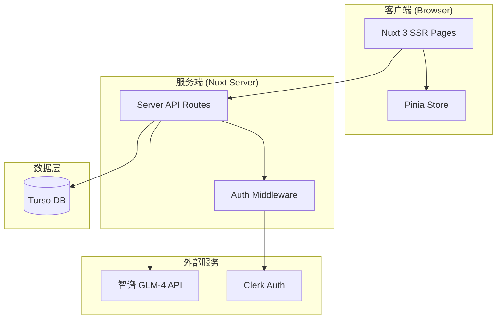
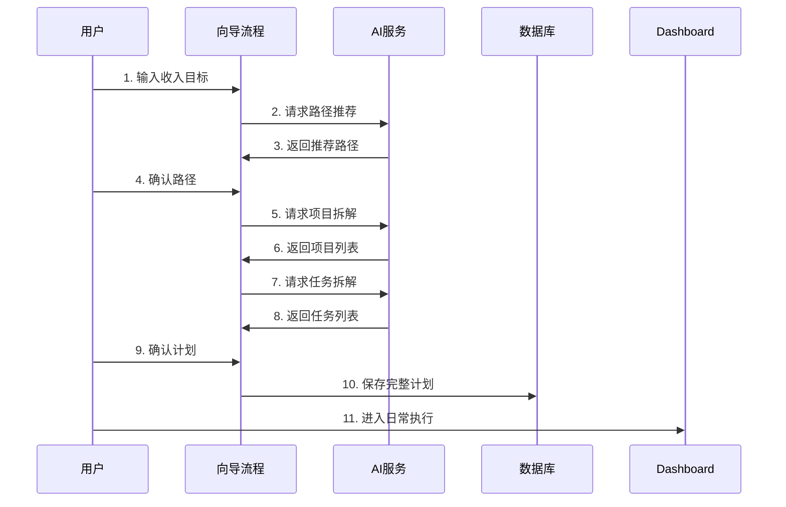
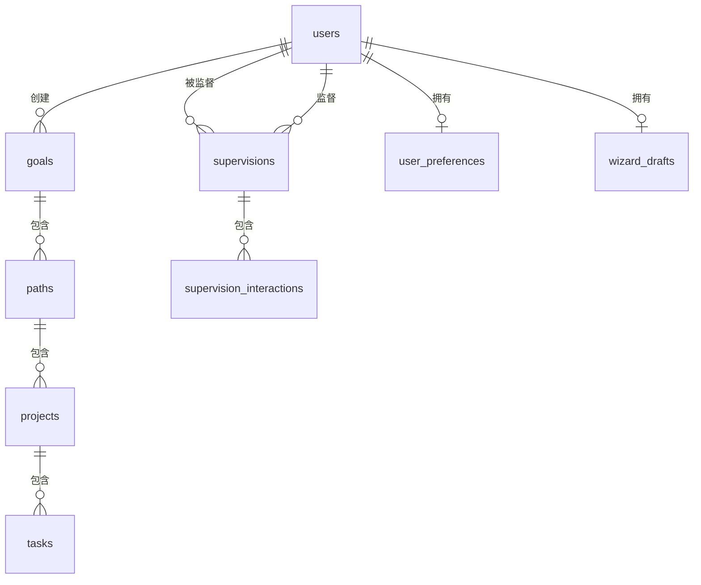

# 钱途 - 技术设计文档

> 版本：v1.0  
> 更新日期：2025-12-30  
> 文档状态：✅ 已完成

---

## 一、概述

### 1.1 产品简介

**钱途**是一款帮助用户将年度收入目标拆解为可执行计划的智能规划工具。通过 AI 辅助，将「想赚100万」这样的年度目标，逐步拆解为：

```
年度目标 → 多条路径 → 具体项目 → 每日任务
```

### 1.2 核心功能模块

| 模块 | 功能描述 | 优先级 |
|------|----------|--------|
| 目标设定与AI拆解 | 引导用户输入目标，AI推荐路径并拆解到任务 | P0 |
| 日常执行 | Dashboard + 任务列表，管理每日任务 | P0 |
| 进度追踪 | 统计完成度，支持计划调整 | P1 |
| 病毒传播 | 好友监督机制，契约签署与分享 | P1 |

---

## 二、技术栈

> ⚠️ **重要说明**：本项目是主项目的子模块，技术栈与主项目保持一致。
> 现有代码已归档，将按本文档全新开发。

### 2.1 核心技术

| 层面 | 技术选型 | 说明 |
|------|----------|------|
| **框架** | Nuxt 3 (SSR) | ^3.20.2，与主项目一致 |
| **语言** | TypeScript | 强类型 |
| **UI库** | **@nuxt/ui** | 基于 Tailwind 的官方组件库 |
| **图标** | lucide-vue-next | 统一图标风格 |
| **数据库** | Supabase (PostgreSQL) | 与主项目共用实例 |
| **认证** | SSO (Shared Cookie) | Share .mirauni.com Cookie |
| **AI模型** | 智谱 GLM-4 | 国产大模型，API调用 |
| **部署** | Vercel | 独立子域名 plan.mirauni.com |

### 2.2 架构模式

> **Monorepo + SSO + 微应用**

- **独立子域名**：部署在 `plan.mirauni.com`
- **SSO 登录**：
  - 共享顶级域名 `.mirauni.com` 下的 Cookie
  - 本项目不提供登录页，未登录直接跳转主站登录
- **UI 交互**：
  - 这是一个独立微应用 (Micro-App)
  - 保留独立的侧边栏和沉浸式体验
  - **关键特征**：右上角包含 "九宫格" (App Switcher) 可快速切换回主站

### 2.3 依赖包

```json
{
  "dependencies": {
    "nuxt": "^3.x",
```json
{
  "dependencies": {
    "nuxt": "^3.20.2",
    "@nuxt/ui": "^2.18.0",
    "@nuxtjs/supabase": "^2.0.3",
    "@pinia/nuxt": "^0.11.3",
    "lucide-vue-next": "^0.562.0",
    "pinia": "^3.0.4",
    "zod": "^3.24.0"
  }
}
```

### 2.4 全局配置 (nuxt.config.ts)

```typescript
export default defineNuxtConfig({
  modules: ['@nuxt/ui', '@pinia/nuxt', '@nuxtjs/supabase'],
  app: {
    head: {
      link: [
        { rel: 'stylesheet', href: 'https://fonts.googleapis.com/css2?family=Space+Grotesk:wght@300;400;500;600;700&display=swap' }
      ]
    }
  },
  // ...
})
```

---

## 三、系统架构

### 3.1 整体架构图



### 3.2 数据流向



### 3.3 目录结构

```
大排期/
├── app/                          # 前端应用
│   ├── pages/                    # 页面组件
│   │   ├── index.vue            # 首页
│   │   ├── wizard.vue           # 向导流程
│   │   ├── dashboard.vue        # 仪表盘
│   │   ├── calendar.vue         # 日历视图
│   │   └── north-star.vue       # 北极星页
│   ├── components/               # UI组件
│   │   ├── wizard/              # 向导相关组件
│   │   ├── dashboard/           # Dashboard组件
│   │   └── ui/                  # 通用UI组件
│   ├── composables/              # 组合式函数
│   ├── stores/                   # Pinia状态管理
│   ├── assets/                   # 静态资源
│   └── plugins/                  # 插件
│
├── server/                       # 后端服务
│   ├── api/                      # API路由
│   │   ├── wizard/              # 向导相关API
│   │   ├── tasks/               # 任务相关API
│   │   ├── projects/            # 项目相关API
│   │   └── dashboard/           # Dashboard API
│   ├── db/                       # 数据库配置
│   └── utils/                    # 工具函数
│
├── docs/                         # 文档
│   ├── prd.md                   # 产品需求文档
│   └── technical-design.md      # 技术设计文档（本文件）
│
├── conductor/                    # 项目管理文档
│   ├── design/                  # 设计文档
│   └── specs/                   # 规格说明
│
├── public/                       # 公共资源
├── nuxt.config.ts               # Nuxt配置
├── package.json                 # 依赖配置
└── tsconfig.json                # TypeScript配置
```

---

## 四、数据库设计

> **说明**：本项目与主项目共用 Supabase 数据库。
> - `users` 表由主项目管理，本项目只读
> - 其他表为本项目新增

### 4.1 ER 关系图



### 4.2 用户表 (users)

```sql
CREATE TABLE users (
  id TEXT PRIMARY KEY,              -- UUID
  wx_openid TEXT UNIQUE,            -- 微信OpenID
  nickname TEXT NOT NULL,           -- 昵称
  avatar_url TEXT,                  -- 头像URL
  phone TEXT,                       -- 手机号（可选）
  created_at INTEGER NOT NULL,      -- 创建时间戳
  updated_at INTEGER NOT NULL       -- 更新时间戳
);

-- 索引
CREATE INDEX idx_users_wx_openid ON users(wx_openid);
```

### 4.3 用户偏好表 (user_preferences)

```sql
CREATE TABLE user_preferences (
  user_id TEXT PRIMARY KEY,                   -- 关联用户ID
  weekly_hours_limit INTEGER DEFAULT 40,      -- 每周可用工时上限
  max_parallel_projects INTEGER DEFAULT 3,    -- 最大并行项目数
  granularity_preference TEXT DEFAULT 'day',  -- 任务粒度偏好：week/day/session
  background TEXT,                            -- 职业背景
  constraints TEXT,                           -- 约束条件（JSON数组）
  updated_at INTEGER NOT NULL,
  FOREIGN KEY (user_id) REFERENCES users(id) ON DELETE CASCADE
);
```

### 4.4 年度目标表 (goals)

```sql
CREATE TABLE goals (
  id TEXT PRIMARY KEY,
  user_id TEXT NOT NULL,
  year INTEGER NOT NULL,                       -- 年份，如2025
  income_target DECIMAL(10,2) NOT NULL,        -- 收入目标（万元）
  status TEXT DEFAULT 'planning',              -- planning/active/completed/dropped
  ai_summary TEXT,                             -- AI理解确认的摘要
  created_at INTEGER NOT NULL,
  updated_at INTEGER NOT NULL,
  FOREIGN KEY (user_id) REFERENCES users(id) ON DELETE CASCADE
);

-- 索引
CREATE INDEX idx_goals_user_year ON goals(user_id, year);
CREATE INDEX idx_goals_status ON goals(status);
```

### 4.5 路径表 (paths)

```sql
CREATE TABLE paths (
  id TEXT PRIMARY KEY,
  goal_id TEXT NOT NULL,
  user_id TEXT NOT NULL,                       -- 冗余字段，便于查询
  name TEXT NOT NULL,                          -- 路径名称，如"做SaaS工具"
  category TEXT NOT NULL,                      -- 类型：product/content/service/ecommerce/investment/offline
  description TEXT,                            -- 具体描述
  income_target DECIMAL(10,2) NOT NULL,        -- 该路径收入目标（万元）
  income_min DECIMAL(10,2),                    -- 预估最低收入
  income_max DECIMAL(10,2),                    -- 预估最高收入
  first_revenue_months INTEGER DEFAULT 6,     -- 预计首次收入月份
  ramp_up_months INTEGER,                      -- 爬坡期（月）
  sort_order INTEGER DEFAULT 0,                -- 排序
  status TEXT DEFAULT 'active',                -- active/paused/completed/dropped
  created_at INTEGER NOT NULL,
  updated_at INTEGER NOT NULL,
  FOREIGN KEY (goal_id) REFERENCES goals(id) ON DELETE CASCADE
);

-- 索引
CREATE INDEX idx_paths_goal ON paths(goal_id);
CREATE INDEX idx_paths_user ON paths(user_id);
CREATE INDEX idx_paths_status ON paths(status);
```

### 4.6 项目表 (projects)

```sql
CREATE TABLE projects (
  id TEXT PRIMARY KEY,
  path_id TEXT NOT NULL,
  user_id TEXT NOT NULL,                       -- 冗余字段
  name TEXT NOT NULL,                          -- 项目名称
  description TEXT,
  duration_weeks INTEGER,                      -- 预计周期（周）
  start_date TEXT,                             -- 开始日期 YYYY-MM-DD
  end_date TEXT,                               -- 结束日期 YYYY-MM-DD
  sort_order INTEGER DEFAULT 0,
  status TEXT DEFAULT 'todo',                  -- todo/in_progress/done
  completed_at INTEGER,                        -- 完成时间
  created_at INTEGER NOT NULL,
  updated_at INTEGER NOT NULL,
  FOREIGN KEY (path_id) REFERENCES paths(id) ON DELETE CASCADE
);

-- 索引
CREATE INDEX idx_projects_path ON projects(path_id);
CREATE INDEX idx_projects_user ON projects(user_id);
CREATE INDEX idx_projects_status ON projects(status);
```

### 4.7 任务表 (tasks)

```sql
CREATE TABLE tasks (
  id TEXT PRIMARY KEY,
  project_id TEXT NOT NULL,
  user_id TEXT NOT NULL,                       -- 冗余字段
  name TEXT NOT NULL,                          -- 任务名称
  description TEXT,
  estimated_hours REAL DEFAULT 2,              -- 预估工时
  actual_hours REAL,                           -- 实际工时
  output_artifact TEXT,                        -- 产出物描述
  planned_date TEXT,                           -- 计划日期 YYYY-MM-DD
  completed_date TEXT,                         -- 完成日期
  sequence_order INTEGER DEFAULT 0,            -- 项目内排序
  status TEXT DEFAULT 'todo',                  -- todo/in_progress/done
  is_completed BOOLEAN DEFAULT 0,
  completed_at INTEGER,
  created_at INTEGER NOT NULL,
  updated_at INTEGER NOT NULL,
  FOREIGN KEY (project_id) REFERENCES projects(id) ON DELETE CASCADE
);

-- 索引
CREATE INDEX idx_tasks_project ON tasks(project_id);
CREATE INDEX idx_tasks_user ON tasks(user_id);
CREATE INDEX idx_tasks_date ON tasks(planned_date);
CREATE INDEX idx_tasks_status ON tasks(status);
CREATE INDEX idx_tasks_user_date ON tasks(user_id, planned_date);
```

### 4.8 监督关系表 (supervisions)

```sql
CREATE TABLE supervisions (
  id TEXT PRIMARY KEY,
  user_id TEXT NOT NULL,                       -- 被监督者
  supervisor_id TEXT NOT NULL,                 -- 监督者（也是user）
  goal_id TEXT NOT NULL,                       -- 关联的目标
  contract_url TEXT,                           -- 契约图片快照URL
  goal_snapshot TEXT,                          -- JSON: 签约时的目标快照
  supervisor_nickname TEXT,                    -- 监督者昵称
  supervisor_avatar TEXT,                      -- 监督者头像
  status TEXT DEFAULT 'active',                -- active/ended
  signed_at INTEGER,                           -- 签约时间
  created_at INTEGER NOT NULL,
  FOREIGN KEY (user_id) REFERENCES users(id) ON DELETE CASCADE,
  FOREIGN KEY (goal_id) REFERENCES goals(id) ON DELETE CASCADE
);

-- 索引
CREATE INDEX idx_supervisions_user ON supervisions(user_id);
CREATE INDEX idx_supervisions_supervisor ON supervisions(supervisor_id);
CREATE UNIQUE INDEX idx_supervisions_unique ON supervisions(user_id, supervisor_id, goal_id);
```

### 4.9 监督互动表 (supervision_interactions)

```sql
CREATE TABLE supervision_interactions (
  id TEXT PRIMARY KEY,
  supervision_id TEXT NOT NULL,
  sender_id TEXT NOT NULL,                     -- 发送者ID
  interaction_type TEXT NOT NULL,              -- encourage/push/comment
  content TEXT NOT NULL,                       -- 评价内容
  is_read BOOLEAN DEFAULT 0,                   -- 是否已读
  created_at INTEGER NOT NULL,
  FOREIGN KEY (supervision_id) REFERENCES supervisions(id) ON DELETE CASCADE
);

-- 索引
CREATE INDEX idx_interactions_supervision ON supervision_interactions(supervision_id);
CREATE INDEX idx_interactions_unread ON supervision_interactions(supervision_id, is_read);
```

### 4.10 向导草稿表 (wizard_drafts)

```sql
CREATE TABLE wizard_drafts (
  id TEXT PRIMARY KEY,
  user_id TEXT NOT NULL UNIQUE,                -- 每用户只保留一个进行中草稿
  current_step INTEGER DEFAULT 1,              -- 当前步骤 1-11
  data TEXT NOT NULL,                          -- JSON: 完整草稿数据
  created_at INTEGER NOT NULL,
  updated_at INTEGER NOT NULL,
  FOREIGN KEY (user_id) REFERENCES users(id) ON DELETE CASCADE
);
```

**草稿 data 结构**：
```json
{
  "incomeGoal": 100,
  "profile": {
    "background": "技术/开发",
    "weeklyHours": "10-20h",
    "constraints": ["露脸", "前期投钱"]
  },
  "openQuestion": "我想做一个开发者工具...",
  "conversations": [
    { "role": "ai", "content": "你提到想做开发者工具..." },
    { "role": "user", "content": "是的，我想..." }
  ],
  "confirmedSummary": { ... },
  "paths": [ ... ],
  "projects": [ ... ],
  "tasks": [ ... ]
}
```

### 4.11 AI对话历史表 (ai_conversations)

```sql
CREATE TABLE ai_conversations (
  id TEXT PRIMARY KEY,
  user_id TEXT NOT NULL,
  goal_id TEXT,                                -- 关联的目标（可选）
  session_type TEXT NOT NULL,                  -- interview/planning/project/task
  messages TEXT NOT NULL,                      -- JSON数组：对话历史
  created_at INTEGER NOT NULL,
  updated_at INTEGER NOT NULL,
  FOREIGN KEY (user_id) REFERENCES users(id) ON DELETE CASCADE
);

-- 索引
CREATE INDEX idx_ai_conv_user ON ai_conversations(user_id);
CREATE INDEX idx_ai_conv_goal ON ai_conversations(goal_id);
```

---

## 五、API 接口设计

### 5.1 认证接口

### 5.1 认证接口 (SSO模式)

> 本项目不处理登录逻辑，仅验证 Token 有效性。

#### GET `/api/auth/me`
获取当前用户信息（从 Shared Cookie 解析 Token）

**Logic**：
1. 从 Cookie 读取 `sb-access-token`
2. 验证 Token 有效性
3. 若无效，返回 401（前端需重定向到主站登录）

**响应**：
```json
{
  "success": true,
  "data": {
    "id": "uuid",
    "nickname": "用户昵称",
    "avatarUrl": "https://..."
  }
}
```

#### POST `/api/auth/logout`
退出登录（清除 Cookie 并跳转主站）

**响应**：
```json
{
  "success": true
}
```

---

### 5.2 向导流程接口

#### POST `/api/wizard/ai/interview`
AI追问（动态对话）

**请求**：
```json
{
  "incomeGoal": 100,
  "profile": {
    "background": "技术/开发",
    "weeklyHours": "10-20h",
    "constraints": ["露脸"]
  },
  "openQuestion": "我想做一个开发者工具",
  "conversationHistory": []
}
```

**响应**：
```json
{
  "success": true,
  "data": {
    "needMoreInfo": true,
    "question": "你提到想做开发者工具，能详细说说想解决什么问题吗？",
    "roundsRemaining": 2
  }
}
```

#### POST `/api/wizard/ai/confirm-summary`
AI理解确认

**响应**：
```json
{
  "success": true,
  "data": {
    "summary": {
      "goal": "年赚100万",
      "background": "5年前端开发",
      "weeklyHours": "10-20小时",
      "constraints": ["不愿意露脸"],
      "idea": "想做一个开发者项目管理工具"
    }
  }
}
```

#### POST `/api/wizard/ai/recommend-paths`
AI推荐路径组合

**响应**：
```json
{
  "success": true,
  "data": {
    "paths": [
      {
        "name": "做项目管理SaaS工具",
        "category": "product",
        "incomeMin": 10,
        "incomeMax": 50,
        "reason": "符合你的想法，技术匹配"
      }
    ],
    "totalIncomeRange": { "min": 45, "max": 130 }
  }
}
```

#### POST `/api/wizard/ai/generate-projects`
AI拆解项目

**响应**：
```json
{
  "success": true,
  "data": {
    "projects": [
      { "name": "产品定位与竞品调研", "durationWeeks": 1 },
      { "name": "开发MVP", "durationWeeks": 6 }
    ]
  }
}
```

#### POST `/api/wizard/ai/generate-tasks`
AI拆解任务

**响应**：
```json
{
  "success": true,
  "data": {
    "tasks": [
      { "name": "列出3个想做的方向", "estimatedHours": 2 },
      { "name": "找5个竞品分析优缺点", "estimatedHours": 4, "outputArtifact": "竞品分析文档" }
    ]
  }
}
```

#### GET `/api/wizard/draft`
获取向导草稿

#### PUT `/api/wizard/draft`
保存向导草稿

#### POST `/api/wizard/save`
保存完整规划（向导完成）

---

### 5.3 任务管理接口

#### GET `/api/tasks`
获取任务列表

**Query参数**：
- `date`: 日期（YYYY-MM-DD），获取某天任务
- `projectId`: 项目ID
- `status`: todo/in_progress/done

**响应**：
```json
{
  "success": true,
  "data": {
    "tasks": [
      {
        "id": "uuid",
        "name": "列出3个想做的方向",
        "estimatedHours": 2,
        "plannedDate": "2025-01-06",
        "status": "todo",
        "project": { "id": "...", "name": "竞品调研" },
        "path": { "id": "...", "name": "SaaS工具" }
      }
    ]
  }
}
```

#### POST `/api/tasks`
创建任务

#### PUT `/api/tasks/:id`
更新任务

#### PUT `/api/tasks/:id/status`
更新任务状态

**请求**：
```json
{
  "status": "done"
}
```

#### PUT `/api/tasks/:id/reschedule`
任务改期

**请求**：
```json
{
  "plannedDate": "2025-01-07"
}
```

#### DELETE `/api/tasks/:id`
删除任务

---

### 5.4 Dashboard接口

#### GET `/api/dashboard/today`
获取今日概览

**响应**：
```json
{
  "success": true,
  "data": {
    "greeting": "早上好",
    "date": "2025-01-06",
    "weekday": "周一",
    "todayTasks": [
      { "id": "...", "name": "...", "path": "SaaS工具", "estimatedHours": 2 }
    ],
    "completedToday": 2,
    "totalToday": 5
  }
}
```

#### GET `/api/dashboard/progress`
获取目标进度

**响应**：
```json
{
  "success": true,
  "data": {
    "yearGoal": { "target": 100, "achieved": 15, "percent": 15 },
    "weeklyHours": { "target": 20, "spent": 8, "percent": 40 },
    "pathProgress": [
      { "name": "SaaS工具", "percent": 12, "status": "有点慢了" },
      { "name": "技术博客", "percent": 5, "status": "完全没动" }
    ]
  }
}
```

#### GET `/api/dashboard/calendar`
获取日历数据

**Query参数**：
- `month`: 月份（YYYY-MM）

**响应**：
```json
{
  "success": true,
  "data": {
    "days": [
      { "date": "2025-01-06", "taskCount": 3, "completedCount": 1 }
    ]
  }
}
```

---

### 5.5 监督功能接口

#### POST `/api/supervision/invite`
生成邀请链接/海报

**响应**：
```json
{
  "success": true,
  "data": {
    "inviteCode": "abc123",
    "inviteUrl": "https://qiantu.app/invite/abc123",
    "posterUrl": "https://..." 
  }
}
```

#### GET `/api/supervision/invite/:code`
获取邀请信息（好友打开时）

**响应**：
```json
{
  "success": true,
  "data": {
    "user": { "nickname": "张三", "avatarUrl": "..." },
    "goal": { "target": 100, "paths": ["SaaS", "博客", "外包"] }
  }
}
```

#### POST `/api/supervision/sign`
签署监督契约

**请求**：
```json
{
  "inviteCode": "abc123"
}
```

#### GET `/api/supervision/my-supervisors`
我的监督者列表

#### GET `/api/supervision/my-supervising`
我监督的人列表

#### GET `/api/supervision/:id/progress`
查看被监督者进度

**响应**：
```json
{
  "success": true,
  "data": {
    "user": { "nickname": "张三" },
    "overallPercent": 35,
    "pathProgress": [...],
    "weeklyStats": { "lazyDays": 2 }
  }
}
```

#### POST `/api/supervision/:id/interact`
发送监督指令

**请求**：
```json
{
  "type": "encourage",
  "content": "加油！"
}
```

---

## 六、前端页面设计

### 6.1 UI 设计规范 (Toon / Neo-Brutalist)

> **设计风格**：沉浸式卡通风格，强调趣味性与高对比度。
> **参考原型**：`new8/index.vue`

#### 配色系统 (Color Palette)
| 名称 | 色值 | 用途 |
|------|------|------|
| **Background** | `#87CEEB` (Sky Blue) | 页面背景 |
| **Surface** | `#FFFFFF` | 卡片/容器背景 |
| **Border** | `#2c3e50` (Dark) | **全局均为 3px-4px 实线** |
| **Primary** | `#4169E1` (Royal Blue) | 主按钮/激活态 |
| **Accent A** | `#FFD700` (Gold) | 装饰/日期胶囊 |
| **Accent B** | `#FF69B4` (Hot Pink) | 强调/行动按钮 |

#### 视觉特征
- **边框**：所有元素（按钮、卡片、输入框）均有 `border-3` 或 `border-4`。
- **阴影**：硬阴影 (Hard Shadow)，`box-shadow: 4px 4px 0 #000`，无模糊。
- **圆角**：大圆角 (`rounded-2xl` ~ `rounded-full`)，部分非对称圆角。
- **动效**：悬停时 `transform: translate(-2px, -2px)`，点击时下沉。
- **装饰**：背景漂浮云朵动画，Blob 形状的图标容器。

#### Tailwind 配置示例
```javascript
theme: {
  extend: {
    colors: {
      toon: {
        bg: '#87CEEB',
        border: '#2c3e50',
        yellow: '#FFD700',
        pink: '#FF69B4',
        blue: '#4169E1'
      }
    },
    borderWidth: {
      '3': '3px',
      '4': '4px'
    },
    boxShadow: {
      'hard': '4px 4px 0 rgba(0,0,0,0.2)',
      'hard-lg': '8px 8px 0 rgba(0,0,0,0.2)'
    }
  }
}
```

### 6.2 页面路由结构

| 路由 | 页面 | 说明 |
|------|------|------|
| `/` | 开始页(P1) | 产品介绍 + 开始规划入口 |
| `/wizard` | 向导流程 | 目标设定全流程(P2-P11) |
| `/dashboard` | 仪表盘(P12) | 每日任务入口 |
| `/tasks` | 任务列表(P13) | 按路径/状态查看任务 |
| `/tasks/:id` | 任务详情(P14) | 单个任务详情 |
| `/calendar` | 日历视图(P15) | 月/周视图 |
| `/invite/:code` | 监督邀请页(P17) | 好友签约页 |
| `/supervision` | 监督面板(P19) | 查看监督对象进度 |
| `/settings` | 设置 | 用户偏好 |

---

### 6.2 向导流程组件 (Wizard)

**组件结构**：
```
wizard/
├── WizardStepper.vue        # 步骤指示器
├── IncomeGoalStep.vue       # P2: 收入目标输入
├── ProfileStep.vue          # P3: 快速画像
├── OpenQuestionStep.vue     # P4: 开放问题
├── AIInterviewStep.vue      # P5: AI动态追问
├── SummaryConfirmStep.vue   # P6: 理解确认
├── PathRecommendStep.vue    # P7: 路径推荐
├── PathDetailStep.vue       # P8: 路径目标设定
├── ProjectBreakdownStep.vue # P9: 项目拆解
├── TaskBreakdownStep.vue    # P10: 任务拆解
├── TimelinePreviewStep.vue  # P11: 时间线预览
├── PathCard.vue             # 路径卡片组件
├── ProjectCard.vue          # 项目卡片组件
└── TaskItem.vue             # 任务条目组件
```

**状态管理** (Pinia):
```typescript
interface WizardStore {
  currentStep: number
  incomeGoal: number
  profile: {
    background: string
    weeklyHours: string
    constraints: string[]
  }
  openQuestion: string
  conversations: Message[]
  confirmedSummary: Summary
  paths: Path[]
  projects: Project[]
  tasks: Task[]
}
```

---

### 6.3 Dashboard组件

```
dashboard/
├── AppSwitcher.vue          # [NEW] 九宫格应用切换器
├── UserAvatar.vue           # [NEW] 用户头像/退出菜单
├── TodayHeader.vue          # 问候语 + 日期
├── TodayTaskList.vue        # 今日任务列表
├── TaskCard.vue             # 任务卡片
├── ProgressBar.vue          # 目标进度条
└── WeeklyStats.vue          # 本周投入统计
```

---

### 6.4 日历组件

```
calendar/
├── CalendarView.vue         # 日历主视图
├── MonthView.vue            # 月视图
├── WeekView.vue             # 周视图
└── DayCell.vue              # 日期单元格
```

---

### 6.5 监督功能组件

```
supervision/
├── InvitePoster.vue         # 邀请海报生成
├── ContractPage.vue         # 契约签署页
├── SignatureAnimation.vue   # 签名动效
├── SupervisionPanel.vue     # 监督面板
├── ProgressCard.vue         # 进度卡片
└── InteractionButtons.vue   # 鼓励/鞭策按钮
```

**契约签署交互**：
1. 长按按钮3秒
2. 羽毛笔动画自动签名
3. 红色印章盖下
4. 契约生效

---

## 七、AI Prompt设计

### 7.1 追问机器人 (Interviewer)

```
你是一位专业的职业规划顾问，正在帮助用户制定年度赚钱计划。

用户信息：
- 收入目标：{{incomeGoal}}万/年
- 背景：{{background}}
- 可投入时间：{{weeklyHours}}
- 约束：{{constraints}}
- 用户想法：{{openQuestion}}

任务：
1. 分析用户信息是否足够制定具体计划
2. 如果不足，提出1-2个具体问题
3. 最多追问3轮

输出格式：
{
  "needMoreInfo": true/false,
  "question": "追问内容",
  "reason": "为什么需要这个信息"
}
```

### 7.2 路径规划师 (Planner)

```
你是一位资深商业分析师。

用户画像：{{summary}}

任务：推荐3-5条适合的赚钱路径组合。

要求：
1. 总预估收入必须覆盖用户目标
2. 符合用户的硬性约束（如不露脸）
3. 考虑用户可投入时间

输出格式：
{
  "paths": [
    {
      "name": "路径名称",
      "category": "product/content/service",
      "incomeMin": 10,
      "incomeMax": 50,
      "reason": "推荐理由",
      "rampUpMonths": 6
    }
  ]
}
```

### 7.3 项目拆解师 (Project Manager)

```
你是一位项目经理。

路径：{{pathName}}
收入目标：{{incomeTarget}}万
期望首次收入：{{firstRevenueMonths}}个月

任务：将路径拆解为3-8个关键里程碑项目。

输出格式：
{
  "projects": [
    { "name": "项目名称", "durationWeeks": 2 }
  ]
}
```

### 7.4 任务执行官 (Task Master)

```
你是一位敏捷教练。

项目：{{projectName}}

任务：拆解为可执行的原子任务（每个2-8小时）。

输出格式：
{
  "tasks": [
    {
      "name": "任务名称",
      "estimatedHours": 4,
      "outputArtifact": "产出物（可选）"
    }
  ]
}
```

---

## 八、部署配置

### 8.1 环境变量

```env
# Supabase数据库
SUPABASE_URL=https://xxx.supabase.co
SUPABASE_ANON_KEY=xxx
SUPABASE_SERVICE_ROLE_KEY=xxx

# 微信登录
WECHAT_APP_ID=xxx
WECHAT_APP_SECRET=xxx

# AI
ZHIPU_API_KEY=xxx
```

### 8.2 Vercel部署

```json
// vercel.json
{
  "buildCommand": "nuxt build",
  "outputDirectory": ".output",
  "framework": "nuxt"
}
```

### 8.3 数据库迁移

```bash
# 在Supabase SQL Editor中执行schema.sql
# 或使用Supabase CLI
supabase db push
```

---

## 九、风险与待优化

| 风险点 | 对策 |
|--------|------|
| AI幻觉 | 前端强调"仅供参考"，知识库维护真实案例 |
| 微信风控 | 文案合规，避免强制分享 |
| 用户流失 | 监督机制 + 每日任务推送（二期） |

---

**文档完成日期**：2025-12-30

